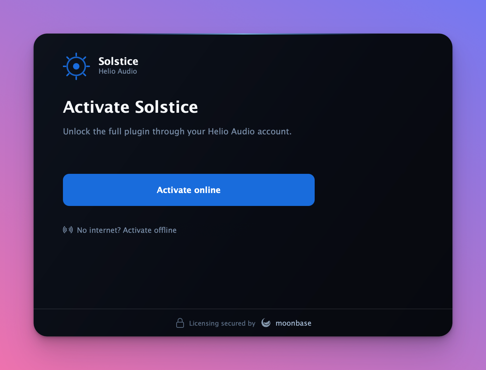
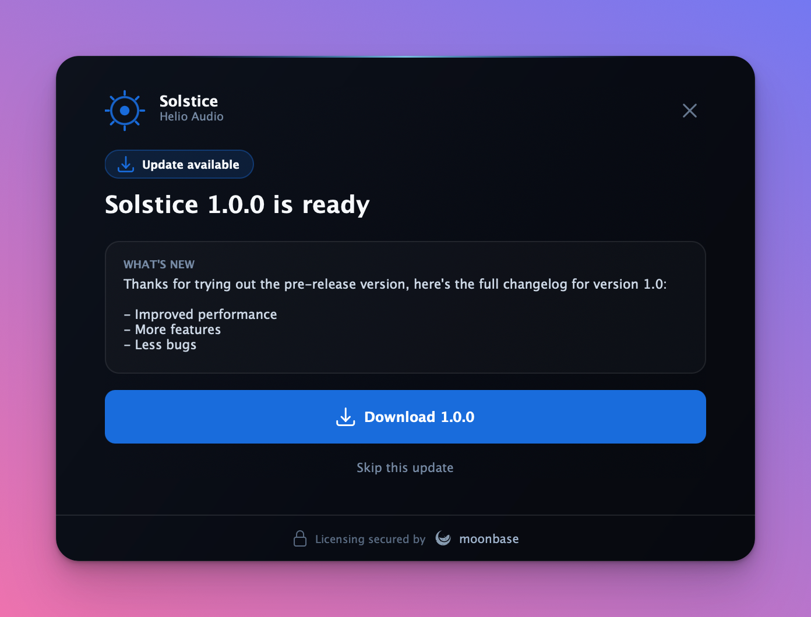

# Moonbase C++ Activation SDK

License activation for desktop apps and audio plugins, in C++.

[](https://github.com/Moonbase-sh/moonbase-cpp/actions/workflows/ci.yml)
[](https://github.com/Moonbase-sh/moonbase-cpp/actions/workflows/juce.yml)
[](https://github.com/Moonbase-sh/moonbase-cpp/releases/latest)
[](https://en.cppreference.com/w/cpp/17)
[](docs/core-sdk.md)
[](#pick-your-path)
[](LICENSE)

Ship a paid plugin or app and you need the same four things: let a customer unlock it,
keep it unlocked offline, tie the seat to a machine, and hand the seat back when they
move. This repo is those four things for C++, as a header-only core library and a
drop-in JUCE module that adds a finished activation UI on top of it.

<p align="center">
  
</p>
<p align="center"><em>The JUCE module's activation UI, themed for a fictional plugin. Your logo, your colours, your copy.</em></p>

## What's in this repo

| | What it is | Where |
| --- | --- | --- |
| **Core SDK** | Header-only C++17 library: activation, polling, local RS256 validation, offline licenses, revocation, pluggable storage and HTTP. No framework. | [`include/moonbase/`](include/moonbase/) |
| **`moonbase_licensing`** | Drop-in JUCE module. The core SDK plus a themeable activation UI, in-app updates, and zero third-party dependencies. | [`modules/moonbase_licensing/`](modules/moonbase_licensing/) |
| **`OnlineUnlockStatus` bridge** | Copy-paste reference header that drives `juce::OnlineUnlockStatus` from Moonbase. You supply the UI. | [`examples/juce/`](examples/juce/) |
| **Fingerprint spec** | The normative, language-neutral device id algorithm every Moonbase SDK implements, with conformance vectors. | [`FINGERPRINT_SPEC.md`](FINGERPRINT_SPEC.md) |

## Pick your path

| | Core SDK | `moonbase_licensing` module | `OnlineUnlockStatus` bridge |
| --- | --- | --- | --- |
| **Form** | Header-only library | Drop-in JUCE module | Copy-paste reference header |
| **Built-in UI** | No | Yes, themeable and animated | No, you build it |
| **Requires** | CMake 3.20, C++17 | JUCE 6.1.3+, C++17 | JUCE 7+, plus the core SDK |
| **Third-party deps** | CURL, OpenSSL, nlohmann_json | None | Inherits the core SDK's |
| **Best for** | Non-JUCE apps, CLI tools, your own frontend | New JUCE plugins that want a ready-made UI, including HISE projects | Projects already on `OnlineUnlockStatus` |
| **Guide** | [`core-sdk.md`](docs/core-sdk.md) | [`juce-module.md`](docs/juce-module.md) | [`juce.md`](docs/juce.md) |

All three compute the same [device id](docs/device-identity.md), so a license activated
through one validates in the others.

## Quick start

### Core SDK

```cmake
include(FetchContent)
FetchContent_Declare(moonbase_cpp
    GIT_REPOSITORY https://github.com/Moonbase-sh/moonbase-cpp.git
    GIT_TAG v4.3.0)
FetchContent_MakeAvailable(moonbase_cpp)

target_link_libraries(your_app PRIVATE moonbase::licensing)
```

```cpp
#include <moonbase/moonbase.hpp>

moonbase::licensing_options options;
options.endpoint   = "https://your-tenant.moonbase.sh";
options.product_id = "your-product";
options.public_key = embedded_public_key_pem;

moonbase::licensing licensing(options);
auto request = licensing.request_activation();   // send the user to request.browser_url
```

Then poll, validate and persist: [core SDK guide](docs/core-sdk.md).

### JUCE module

```cmake
juce_add_module(path/to/moonbase-cpp/modules/moonbase_licensing)
target_link_libraries(MyPlugin PRIVATE moonbase_licensing)
```

```cpp
#include <moonbase_licensing/moonbase_licensing.h>
using namespace moonbase::juce_integration;

ActivationConfig config;
config.endpoint  = "https://your-tenant.moonbase.sh";
config.productId = "your-product";
config.publicKey = embeddedPublicKeyPem;

addAndMakeVisible(activation = std::make_unique<ActivationComponent>(config));
```

Three fields and one component, and every screen below is wired up:
[module overview](modules/moonbase_licensing/), [full guide](docs/juce-module.md).

### `OnlineUnlockStatus` bridge

Copy [`examples/juce/MoonbaseJuceBridge.h`](examples/juce/MoonbaseJuceBridge.h) into
your project and use `MoonbaseUnlockStatus` wherever you use
`juce::OnlineUnlockStatus` today: [bridge guide](docs/juce.md).

<p align="center">
  
  
</p>
<p align="center"><em>Trials and in-app updates, both built into the module.</em></p>

## What you get

- **Browser activation.** The app asks for a request, opens a URL, and polls. No serial
  numbers to type, no keyfiles to email.
- **Offline activation.** Either mint an offline license through the normal browser
  flow, or, on a machine with no network at all, exchange a device token file for a
  license token file. Both produce a permanent, locally-validated license.
- **Local-first validation.** Signature, audience, issuer, device and expiry are checked
  in-process. The API is contacted at most every few minutes, and a configurable grace
  period keeps a plugin working through an outage.
- **Cross-SDK device identity.** A SHA-256 of stable native hardware identifiers, per
  the [shared spec](FINGERPRINT_SPEC.md). No subprocess, no root-only file, so it works
  inside an App Sandbox and a plugin host and reads the same elevated or not.
- **Trials, seats and entitlements.** Trial state, seat counts, expiry, sub-product
  ownership and custom properties all arrive on the validated license, so you can gate
  on more than a boolean.
- **In-app updates.** The module surfaces a newer entitled release, shows its notes, and
  downloads the installer for the user's platform with progress.

## Reference implementations

Two real JUCE 8 projects built as reference integrations. Their knobs deliberately do
not process audio; the point is the licensing workflow wrapped around a real plugin.

**[DRIFT by Corino](https://github.com/Moonbase-sh/corino-drift)** (VST3 / AU /
Standalone) is the **native module** reference. The processor owns a headless
`ActivationController`, `LicenseGate` fades to silence off a lock-free flag in
`processBlock`, and the editor shows `ActivationComponent` as a modal overlay. Every
connection, branding, trial and telemetry field lives in one shared factory:
[`src/Licensing.h`](https://github.com/Moonbase-sh/corino-drift/blob/main/src/Licensing.h).

**[HALO by Corino](https://github.com/Moonbase-sh/corino-halo)** (standalone app) is the
**bridge** reference: a synchronous local check on startup, background re-validation,
timer-polled activation, and a "Sign out" item wired to revocation with a local-only
fallback. It vendors the bridge header verbatim from this repo:
[`src/license/HaloLicenseBridge.cpp`](https://github.com/Moonbase-sh/corino-halo/blob/main/src/license/HaloLicenseBridge.cpp).

## Documentation

| | |
| --- | --- |
| [Core SDK](docs/core-sdk.md) | Install, CMake options, activation, validation, revocation, offline licenses, custom storage |
| [JUCE module](docs/juce-module.md) | Setup, the flow, gating, theming, updates, diagnostics, telemetry |
| [`OnlineUnlockStatus` bridge](docs/juce.md) | Wiring, async activation, deactivation, gating, metadata |
| [Device identity](docs/device-identity.md) | What the device id is made of, failure modes, diagnostics |
| [Fingerprint spec](FINGERPRINT_SPEC.md) | The normative cross-SDK algorithm and stability contract |
| [Security](docs/security.md) | What the SDK guarantees, what it leaves to you, and how to gate well |
| [Migrating from 3.x](docs/migration-3x.md) | The 4.0.0 device id change, and how to migrate a shipped fleet |
| [Contributing](CONTRIBUTING.md) | Build, test, generated files, CI, releases |
| Samples | [core](examples/activation.cpp), [JUCE module](examples/juce-native/), [bridge](examples/juce/), [UI snapshots](tests/visual/) |

## Security

This SDK answers one question soundly: is this license valid, for this product, on this
machine, right now? It deliberately ships no anti-debugging, obfuscation or tamper
detection, because anything general enough to live in an open-source header is
identical in every plugin using it, and one published bypass would apply to all of
them. Hardening belongs in your binary. [How to do it well](docs/security.md).

## Versioning

Semantic versioning, tagged `v<major>.<minor>.<patch>`. Source archives are published
per tag at
`https://github.com/Moonbase-sh/moonbase-cpp/archive/refs/tags/v<version>.tar.gz`, and
the installed CMake package declares `SameMajorVersion` compatibility.

## License

Released under the [MIT License](LICENSE).
