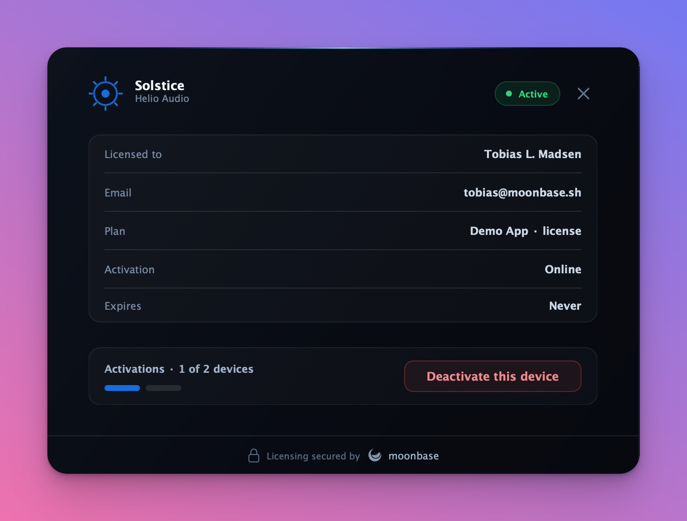

# Moonbase C++ Activation SDK

Header-only C++17 SDK for Moonbase license activation. It supports activation requests, polling for fulfilled activations, local RS256 JWT validation, overridable device fingerprinting, and overridable license storage.

## Requirements

- CMake 3.20 or newer
- A C++17 compiler
- Windows, macOS, or Linux (the default fingerprint provider has native implementations for each)
- `CURL::libcurl` and OpenSSL (`OpenSSL::SSL`, `OpenSSL::Crypto`) — must be findable on the system (e.g. via your distro, Homebrew, or vcpkg)
- `nlohmann_json` 3.11+ — used if `find_package(nlohmann_json)` succeeds; otherwise it is fetched automatically at build time from the upstream release tarball

The installed package config calls `find_dependency()` for CURL, OpenSSL, and nlohmann_json, so a consuming project does not need to repeat those `find_package` calls itself — but the libraries must be available when `find_package(moonbase_cpp)` is invoked.

## Installation

### Install from source

Clone the repository (or download a release tarball at `https://github.com/Moonbase-sh/moonbase-cpp/archive/refs/tags/v<version>.tar.gz`), then configure, build, and install:

```bash
cmake -B build -DMOONBASE_BUILD_TESTS=OFF -DMOONBASE_BUILD_EXAMPLES=OFF
cmake --build build
cmake --install build --prefix /your/prefix
```

### FetchContent

To pull the SDK into your own CMake build without a separate install step:

```cmake
include(FetchContent)
FetchContent_Declare(moonbase_cpp
    GIT_REPOSITORY https://github.com/Moonbase-sh/moonbase-cpp.git
    GIT_TAG v3.3.0)
set(MOONBASE_BUILD_TESTS OFF)
set(MOONBASE_BUILD_EXAMPLES OFF)
FetchContent_MakeAvailable(moonbase_cpp)

target_link_libraries(your_app PRIVATE moonbase::licensing)
```

`add_subdirectory()` works the same way if you vendor the source tree into your repo.

## CMake

```cmake
find_package(moonbase_cpp REQUIRED)

target_link_libraries(your_app PRIVATE moonbase::licensing)
```

The package exports the `moonbase::licensing` interface target, which propagates the include directory along with `CURL::libcurl`, `OpenSSL::SSL`, `OpenSSL::Crypto`, and `nlohmann_json::nlohmann_json` as transitive dependencies.

The build provides three options, all useful when consuming the SDK as a subproject:

| Option | Default | Purpose |
| --- | --- | --- |
| `MOONBASE_BUILD_TESTS` | `ON` for the top-level project, `OFF` as a subproject | Build the doctest-based unit and live tests. |
| `MOONBASE_BUILD_EXAMPLES` | `ON` for the top-level project, `OFF` as a subproject | Build the standalone activation example under `examples/`. |
| `MOONBASE_BUILD_JUCE_EXAMPLE` | `OFF` | Fetch JUCE and build the JUCE `OnlineUnlockStatus` bridge example (see below). |
| `MOONBASE_BUILD_JUCE_NATIVE_EXAMPLE` | `OFF` | Fetch JUCE and build the `moonbase_licensing` native module example (see below). |

Override `MOONBASE_BUILD_TESTS` and `MOONBASE_BUILD_EXAMPLES` explicitly when you want a subproject integration to build SDK artifacts too.

## Basic Usage

```cpp
#include <moonbase/moonbase.hpp>

moonbase::licensing_options options;
options.endpoint = "https://demo.moonbase.sh";
options.product_id = "demo-app";
options.public_key = public_key_pem;
options.account_id = "tenant-id"; // optional issuer check
options.http_connect_timeout = std::chrono::seconds(10);
options.http_request_timeout = std::chrono::seconds(30);

moonbase::licensing licensing(options);

auto request = licensing.request_activation();
std::cout << "Open: " << request.browser_url << "\n";

std::optional<moonbase::license> license;
while (!license) {
    std::this_thread::sleep_for(std::chrono::seconds(1));
    license = licensing.get_requested_activation(request);
}

licensing.store().store_local_license(*license);
```

On startup, validate the stored token. `validate_token_online` runs the local
checks (signature, device fingerprint, expiry) and then re-validates against the
Moonbase API when needed:

```cpp
if (auto local = licensing.store().load_local_license()) {
    auto validated = licensing.validate_token_online(local->token);
    licensing.store().store_local_license(validated); // persist refreshed token
}
```

Two `licensing_options` knobs control how often the API is contacted and how
much offline tolerance is allowed:

- `online_validation_min_interval` (default 5 minutes) — if the local
  `validated_at` is newer than this, the API call is skipped. Makes the method
  cheap to call frequently (e.g. on every plugin instantiation).
- `online_validation_grace_period` (default 7 days) — maximum age the local
  token may reach without a successful online check. Within grace, transient
  API failures (network down, 5xx, etc.) fall back to the local result. Beyond
  grace, the failure is propagated.

Definitive server rejections (`license_invalid_error`, `license_expired_error`)
always propagate regardless of grace.

Offline-activated tokens (`activation_method::offline`) are validated locally
even when calling `validate_token_online` — the SDK never contacts the API for
them. Use `validate_token_local` directly when you want the local-only check
explicitly.

## Revoking an Activation

To free up the activation seat for the current device — typically wired to a
"Deactivate" or "Sign out" button — call `revoke_activation` with the JWT:

```cpp
if (auto local = licensing.store().load_local_license()) {
    licensing.revoke_activation(local->token); // server-side revoke + clears local store
}
```

On success the SDK both tells the server to release the seat and deletes the
matching license from the local store. Revoke is only meaningful for
online-activated paid licenses; calling it for offline or trial tokens raises
`operation_not_supported_error` without contacting the API. Server rejections
(`license_invalid_error`) and transport failures (`api_error`) propagate the
same way they do for `validate_token_online`, but with no grace-period
fallback — revoke is a one-shot operation.

## Offline Activation

For machines without internet access, Moonbase supports a file-based flow: the
app emits a **device token** ("machine file"), the user exchanges it for a
license token on the Moonbase activation page, and the app reads that token back
in. No network is involved on the device.

1. Generate the device token and write it to a file (conventionally `.dt`):

   ```cpp
   const auto device_token = licensing.generate_device_token();
   std::ofstream("device-token.dt") << device_token;
   ```

2. The user uploads `device-token.dt` and receives a license token file (the
   raw JWT, conventionally `license.mb`) in return. They can do this through any
   of:

   - **Moonbase's hosted portal** — `https://<your-tenant>.moonbase.sh/activate`.
   - **The embedded storefront on your own site** — trigger the
     [`activate_product`](https://moonbase.sh/docs/storefronts/embedded/#call-methods)
     intent (`Moonbase.activate_product()`), which prompts for the device token
     and hands back the license token file. The `deviceTokenFileExtension`
     (default `.dt`) and `licenseTokenFileName` (default `license-file.mb`)
     config options control the file types involved.
   - **Your own custom flow** — drive the exchange yourself with the Moonbase
     [APIs and SDKs](https://moonbase.sh/docs/licensing/offline-activations/)
     (the `/api/customer/inventory/activate` endpoint).

3. Read the downloaded token back in, validate it locally, and persist it:

   ```cpp
   std::ifstream file("license.mb");
   const std::string token((std::istreambuf_iterator<char>(file)),
                           std::istreambuf_iterator<char>());

   auto license = licensing.read_offline_license(token); // local validation only
   licensing.store().store_local_license(license);
   ```

`read_offline_license` runs the same local checks as `validate_token_local`
(signature, audience, issuer, device fingerprint, expiry) and additionally
requires the token to have been issued via offline activation, throwing
`license_invalid_error` otherwise. On startup, validate the stored token with
`validate_token_local` — offline tokens are never re-validated against the API
and [cannot be revoked](#revoking-an-activation); they stay valid until the
machine's device fingerprint changes.

## Custom Fingerprinting and Storage

```cpp
class my_fingerprint final : public moonbase::fingerprint_provider {
public:
    std::string device_name() const override { return "Studio Mac"; }
    std::string device_id() const override { return "stable-device-id"; }
};

auto store = std::make_shared<moonbase::file_license_store>("licenses/license.mb");
auto fingerprint = std::make_shared<my_fingerprint>();
moonbase::licensing licensing(options, store, fingerprint);
```

The default store is in-memory. `file_license_store` persists a JSON representation of the validated license.

The default fingerprint provider builds a stable, native hardware fingerprint
from platform identity parameters such as SMBIOS fields on Windows,
`IOPlatformUUID` on macOS, and board/BIOS/CPU fields on Linux. Use a custom
`fingerprint_provider` when you need an exact legacy fingerprint or any other
application-specific device ID. If you include narrow SDK headers instead of
`<moonbase/moonbase.hpp>`, include `<moonbase/default_fingerprint.hpp>` for the
native provider and `<moonbase/http_curl.hpp>` for the default CURL transport.

## JUCE Plugins

For JUCE-based plugins and applications there are two integration paths, both
built on the same `moonbase::licensing` core SDK. The native
[`moonbase_licensing`](docs/juce-module.md) module is the recommended choice for
new projects; the [`juce::OnlineUnlockStatus` bridge](docs/juce.md) remains
available and unchanged.

| | Native module | `OnlineUnlockStatus` bridge |
| --- | --- | --- |
| **Form** | Drop-in JUCE module | Copy-paste reference header |
| **Built-in UI** | Yes (polished, animated, themeable) | No (you build it) |
| **JUCE integration** | Native Moonbase API | `juce::OnlineUnlockStatus` wrapper |
| **JUCE version** | 8.0.4+ | 7+ |
| **Third-party deps** | None (JUCE `WebInputStream` HTTP, bundled `nlohmann/json`, OS-native RS256) | Inherits the core SDK's CURL + OpenSSL |
| **Entry point** | `ActivationComponent` / `ActivationDialog` | `MoonbaseUnlockStatus` |
| **Best for** | New plugins wanting a ready-made UI | Apps already on `OnlineUnlockStatus`, or JUCE 7 |
| **Docs** | [`docs/juce-module.md`](docs/juce-module.md) | [`docs/juce.md`](docs/juce.md) |

### Native module: `moonbase_licensing`

A drop-in JUCE 8 module that adds Moonbase activation, plus a built-in
themeable activation UI, to any app or plugin. It talks to the Moonbase
licensing API natively (it does not use `juce::OnlineUnlockStatus`) and has no
third-party dependencies: HTTP goes through `juce::WebInputStream`, JSON is a
bundled `nlohmann/json`, and RS256 verification uses the OS-native crypto
(Security.framework, CNG/bcrypt, libcrypto). The module lives at
[`modules/moonbase_licensing/`](modules/moonbase_licensing/); add it with
`juce_add_module()` (or via Projucer), fill in three config fields, and show one
`ActivationComponent`. See [`docs/juce-module.md`](docs/juce-module.md) for the
full guide.

<p align="center">
  
</p>

Build the in-repo sample app with:

```bash
cmake -B build -DMOONBASE_BUILD_JUCE_NATIVE_EXAMPLE=ON
cmake --build build --target MoonbaseActivationNative
```

#### Reference implementation: DRIFT

[**DRIFT by Corino**](https://github.com/Moonbase-sh/corino-drift) is a JUCE 8
VST3 / AU / Standalone plugin built as a reference implementation of this module
(the native-module counterpart to [HALO](https://github.com/Moonbase-sh/corino-halo),
which uses the bridge). Its knobs are real, automatable parameters that
deliberately don't process audio; the point is the activation workflow wrapped
around a real plugin:

- The processor owns the headless `ActivationController` as the single source of
  truth and calls `start()` to load + validate any stored license on a background
  thread, updating the audio-thread-safe `licensedFlag()`.
- `LicenseGate` reads that lock-free flag in `processBlock` and fades to silence
  when unlicensed (and back up when licensed), so gating never clicks.
- The editor shares the processor's controller and shows the module's brandable
  `ActivationComponent` as a modal overlay (`overlayBackdrop = true`), opened from
  a "Manage License" button via `appear()`; `onActivationChanged` keeps the UI in
  sync with no re-wiring.
- Every connection, branding, trial and telemetry field lives in one
  `makeDriftActivationConfig()` factory shared by the processor and the editor.
- GitHub Actions CI + release pipelines build the plugin bundles across platforms.

DRIFT consumes the module via `FetchContent` + `juce_add_module()` (no git
submodule). See
[`src/Licensing.h`](https://github.com/Moonbase-sh/corino-drift/blob/main/src/Licensing.h)
for the single config point and its
[`CMakeLists.txt`](https://github.com/Moonbase-sh/corino-drift/blob/main/CMakeLists.txt)
for the full wiring.

### `OnlineUnlockStatus` bridge

A drop-in bridge ([`docs/juce.md`](docs/juce.md)) that wires Moonbase activation
into `juce::OnlineUnlockStatus`, sources the device fingerprint from JUCE's
`SystemStats` helpers, and populates activation metadata with host/system
context (DAW, plugin format, OS, CPU, JUCE version). The bridge header lives at
[`examples/juce/MoonbaseJuceBridge.h`](examples/juce/MoonbaseJuceBridge.h) and is
copy-pasteable into any JUCE project; you supply your own activation UI.

Build the in-repo sample app with:

```bash
cmake -B build -DMOONBASE_BUILD_JUCE_EXAMPLE=ON
cmake --build build --target MoonbaseJuceExample
```

The flag is opt-in: JUCE is fetched and compiled only when it's set (the same
applies to `MOONBASE_BUILD_JUCE_NATIVE_EXAMPLE`).

#### Reference implementation: HALO

[**HALO by Corino**](https://github.com/Moonbase-sh/corino-halo) is a JUCE 8
standalone GUI application built specifically as a reference implementation
of this SDK. It's a saturator-styled app that doesn't actually process
audio; the entire point is the license-gate workflow around it:

- Startup runs a synchronous local JWT check, then re-validates against the
  Moonbase API on a background thread via `tryLoadStoredLicenseAsync`.
- Browser activation handshake with 1-second `juce::Timer` polling.
- "Sign out" menu item wired to `revokeActivationAsync` with a graceful
  `NotRevokable` fallback to a local-only forget.
- `file_license_store` persisted under the platform's per-user app data
  directory.
- GitHub Actions release pipeline that builds on macOS + Windows and
  publishes binaries straight to a Moonbase tenant.

HALO vendors the bridge header verbatim from this repo and consumes
`moonbase::licensing` via `FetchContent`. See
[`src/license/HaloLicenseBridge.cpp`](https://github.com/Moonbase-sh/corino-halo/blob/main/src/license/HaloLicenseBridge.cpp)
and its [`CMakeLists.txt`](https://github.com/Moonbase-sh/corino-halo/blob/main/CMakeLists.txt)
for the full wiring.

## Live Tests

Unit tests do not hit the network. Live API tests are opt-in:

```bash
scripts/test.sh
scripts/test.sh --live
```

Defaults target the demo setup used by the Node SDK:

- `MOONBASE_CPP_ENDPOINT`, default `https://demo.moonbase.sh`
- `MOONBASE_CPP_PRODUCT_ID`, default `demo-app`
- `MOONBASE_CPP_PUBLIC_KEY`, default demo public key
- `MOONBASE_CPP_ACCOUNT_ID`, optional issuer check

Live tests create a unique activation request and try to fulfill it through the anonymous trial endpoint.

## Releases

Releases are fully automated by [semantic-release](https://semantic-release.gitbook.io/) running on every push to `main`. The next version is determined by [Conventional Commits](https://www.conventionalcommits.org/):

- `fix: ...` &rarr; patch (e.g. `0.1.0` &rarr; `0.1.1`)
- `feat: ...` &rarr; minor (e.g. `0.1.0` &rarr; `0.2.0`)
- `feat!: ...` or any commit with a `BREAKING CHANGE:` footer &rarr; major

Pull requests must be merged with **squash merging**, and the PR title must follow Conventional Commits — that title becomes the squash commit on `main` and is what semantic-release reads. The `PR Title` workflow enforces this on every PR.

Each release:

- Bumps `VERSION` in `CMakeLists.txt` (which flows into `MOONBASE_CPP_VERSION` and the `User-Agent: moonbase-cpp/<version>` header)
- Updates `CHANGELOG.md`
- Tags the commit and creates a GitHub Release (with the auto-generated source archives at `https://github.com/<owner>/<repo>/archive/refs/tags/v<version>.tar.gz`)

## License

Released under the [MIT License](LICENSE).
