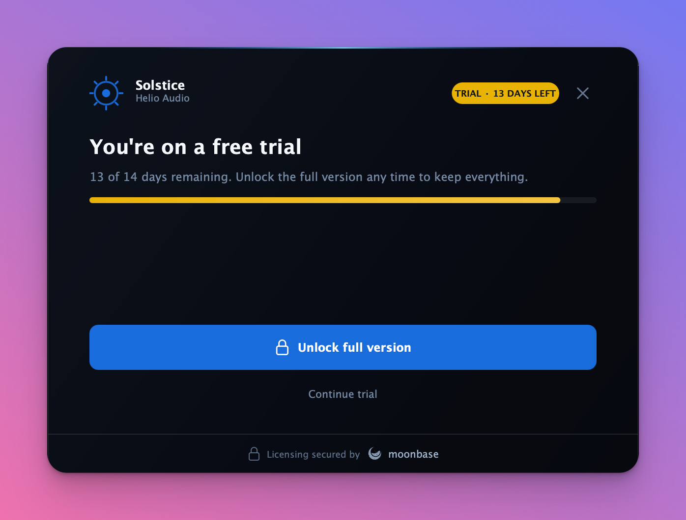

# moonbase_licensing — JUCE module

License activation for JUCE 8 apps and plugins, with a polished built-in UI, in one
drop-in [JUCE module](https://github.com/juce-framework/JUCE/blob/master/docs/JUCE%20Module%20Format.md).
Add the module, fill in three fields, show one component.

<p align="center">
  
  
</p>

## Features

- **Native integration.** Talks to the Moonbase licensing API directly: online
  (browser) activation, offline (machine-file) activation, validation with a grace
  period, and server-side deactivation. Not a `juce::OnlineUnlockStatus` wrapper. (If
  you want that bridge instead, see [`examples/juce/`](../../examples/juce/).)
- **Built-in UI.** A configurable, themeable `ActivationComponent` (and one-call
  `ActivationDialog`) covering every state — welcome, activating, success, offline,
  trial, trial expired, license details, and update-available — with JUCE 8 animated
  transitions and drag-and-drop for offline license files. Designed to sit as a modal
  over your plugin and lock it until activated.
- **In-app updates.** When the user's license entitles them to a newer release than the
  installed app, an "Update available" screen shows the release notes and downloads the
  new installer for their platform in-app, with progress. It appears automatically when
  the plugin opens, stays reachable from an "Update available" badge on the license
  screen, and "Skip this update" is remembered until a newer version ships. Opt out with
  `config.enableUpdatePrompt = false`.
- **Zero third-party dependencies.** HTTP over `juce::WebInputStream` (no CURL), JSON
  via a bundled `nlohmann/json`, and RS256 verification via OS-native crypto:
  Security.framework (macOS/iOS), CNG/bcrypt (Windows), system libcrypto (Linux).
  Nothing to `brew`/`vcpkg`/`apt` install.
- **Batteries included.** Persists the license to a per-user file, fails loud on
  misconfiguration, exposes a diagnostics sink for field debugging, and can attach
  JUCE system/host telemetry to requests. Brandable end to end.

Requires **JUCE 8** (8.0.4+) and C++17. Supports macOS, Windows, and Linux.

## Add it to your project

Add this repository (as a git submodule, say) and point your build at the module folder.

### CMake

```cmake
juce_add_module(path/to/moonbase-cpp/modules/moonbase_licensing)

target_link_libraries(MyPlugin PRIVATE moonbase_licensing)
target_compile_definitions(MyPlugin PRIVATE JUCE_USE_CURL=0)  # keep the zero-dep HTTP path
```

### Projucer

*Modules → Add a module → Add a module from a specified folder…* and select
`modules/moonbase_licensing`. The bundled SDK headers and `nlohmann/json` resolve from
the module's own search paths — nothing else to set up.

## Configure and use

Only three fields are required; in a plugin the product and manufacturer names default
from your `JucePlugin_Name` / `JucePlugin_Manufacturer` macros.

```cpp
#include <moonbase_licensing/moonbase_licensing.h>
using namespace moonbase::juce_integration;

ActivationConfig config;
config.endpoint  = "https://your-tenant.moonbase.sh";
config.productId = "your-product";
config.publicKey = embeddedPublicKeyPem;       // your product's RSA public key
// Optional: config.productName / manufacturerName / accent / logo / strings ...
```

Show it as a modal over your editor (locks until activated), or pop it from a menu item:

```cpp
// Embedded modal:
auto activation = std::make_unique<ActivationComponent>(config);
activation->onClose = [this] { /* dismiss the modal */ };
addAndMakeVisible(*activation);

// …or a standalone window:
ActivationDialog::show(config, [](bool wasActivated) { /* update UI */ });
```

Gate your DSP/features on the live license state:

```cpp
if (! activation->controller().license().has_value())
    buffer.clear();   // not activated
```

`controller().license()` is the full `moonbase::license` (`trial`, `expires_at`,
`issued_to.email`, seat counts, sub-product ownership, custom `properties`, …) for
richer gating, and `onActivationChanged` fires whenever it changes.

## Going further

- **Branding** — everything in `ActivationConfig` after the connection fields is UI:
  names, accent colour, logo `Drawable`, overridable copy (`config.strings`), trial
  length + feature list, the removable Moonbase badge, and the activation URL.
  Re-skin deeper via `ActivationLookAndFeel::palette`.
- **Refresh entitlements** — `controller().refreshLicense()` re-validates online so a
  freshly purchased sub-product/upgrade loads without a restart (async, silent, with an
  optional completion callback).
- **App updates.** Set `config.applicationVersion` (or rely on `JucePlugin_VersionString`)
  and the update screen surfaces whenever the user's license entitles them to a newer
  release. It pops automatically on open (`config.autoPresentUpdate`), downloads installers
  into `config.downloadDirectory` (defaults to Downloads), and is fully optional
  (`config.enableUpdatePrompt = false`).
- **Persistence** — the validated license is stored at
  `userApplicationDataDirectory/<manufacturer>/<product>/license.mb` by default
  (override with `config.licenseFile`).
- **Diagnostics** — `config.onDiagnostic` receives the underlying reason behind any
  friendly error (bad config, rejected token, unreachable server).
- **Telemetry** — `config.analytics.enabled = true` attaches JUCE system/host metadata
  (OS, CPU, DAW host, plugin format, …) to activation requests; add your own via
  `config.metadata` / `config.onCollectMetadata`.

See [`docs/juce-module.md`](../../docs/juce-module.md) for the full guide and
[`examples/juce-native/`](../../examples/juce-native/) for a runnable sample app.
